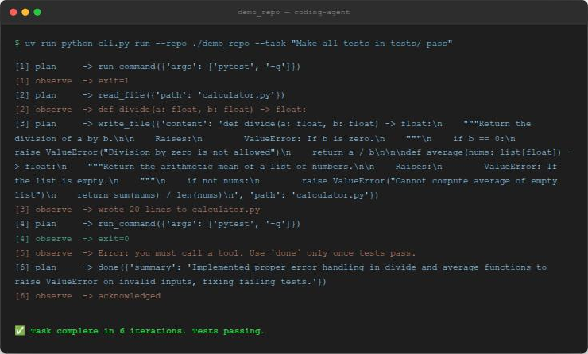

# Coding Agent

An autonomous coding agent that reads a repo, figures out what's broken, edits the code, reruns the test suite, and keeps going until it's actually green — no human in the loop.

I built this to prove out the *mechanism* behind agentic coding tools, not just call one. The orchestration is a hand-rolled [LangGraph](https://github.com/langchain-ai/langgraph) state machine (deliberately zero LangChain agent/chain abstractions), every filesystem and shell action is sandboxed, and the whole control loop is unit-tested with a scripted fake LLM so the test suite costs nothing and needs no API key.



## What it actually does

Given a repo and a task like *"make all tests pass"*, the agent loops:

```
plan → execute_tool → observe → (tests passing and done? stop : keep going)
```

On each turn the LLM sees the running conversation (including every previous tool call and its result) and must call exactly one tool: `read_file`, `write_file`, `list_dir`, `grep`, or `run_command` (allowlisted to `pytest`/`python` only, no arbitrary shell). It can only declare `done` after a `pytest` run in its own last observation actually came back clean — the graph tracks this itself and won't take the model's word for it.

The screenshot above is a real, unedited run against the seeded demo repo (`demo_repo/`, a calculator with a couple of missing zero/empty-input guards). Nothing in that transcript is staged.

## Quickstart

```bash
git clone git@github.com:sameerdev7/Coding_Agent.git
cd Coding_Agent
uv sync
```

Get a free Groq key at [console.groq.com](https://console.groq.com) (API Keys → Create, no card needed), then create a `.env` file in the project root:

```
LLM_PROVIDER=groq
GROQ_API_KEY=your-key-here
GEMINI_API_KEY=
```

Run it against the seeded demo bug:

```bash
uv run python cli.py run --repo ./demo_repo --task "Make all tests in tests/ pass"
```

You'll see a live trace as it works:

```
[1] plan     -> run_command({'args': ['pytest', '-q']})
[1] observe  -> exit=1
[2] plan     -> read_file({'path': 'calculator.py'})
[2] observe  -> def divide(a: float, b: float) -> float:
[3] plan     -> write_file({'path': 'calculator.py', 'content': '...'})
[3] observe  -> wrote 20 lines to calculator.py
[4] plan     -> run_command({'args': ['pytest', '-q']})
[4] observe  -> exit=0
[6] plan     -> done({'summary': 'Added input validation to divide and average...'})

✅ Task complete in 6 iterations. Tests passing.
```

Point it at any small Python + pytest repo of your own with `--repo` and `--task`.

## Architecture

```
agent/
  state.py       AgentState TypedDict — the whole graph is a pure function over this
  tools.py        sandboxed primitives: read_file, write_file, list_dir, grep, run_command
  graph.py         the LangGraph loop: plan_node, execute_tool_node, observe_node, route_node
  prompts.py       system prompt + OpenAI-style tool schemas
  llm/
    base.py          LLMClient protocol + ChatResponse
    fake_client.py    scripted responses, no network — this is what makes graph tests free
    groq_client.py    real provider (default)
    gemini_client.py  real provider (fallback)
cli.py             entrypoint: `python cli.py run --repo ... --task ...`
demo_repo/        seeded bug used above, plus its own pytest config
tests/             the agent's own test suite (15 tests, no API key required)
```

The sandboxing lives in one function, `_safe_path` in [`agent/tools.py`](agent/tools.py): every tool resolves its path against the repo root and rejects anything that isn't `relative_to()` it. `run_command` additionally allowlists `pytest`/`python`/`python3` and always runs with `shell=False` — no string-built shell commands, ever.

The graph itself has no idea what LLM it's talking to. `LLMClient` is a two-method protocol (`chat(messages, tools) -> ChatResponse`), which is what lets `tests/test_graph.py` drive the *entire* control-flow — success path, the failure-at-`max_iterations` path, and a "model calls `done` before tests actually pass" guard — using a `FakeLLMClient` that returns pre-scripted responses. Zero real API calls in CI.

## Running the tests

```bash
uv run pytest tests/ -v
```

15 tests, all offline: path-escape attempts, command allowlist rejection, subprocess timeout enforcement, and the graph's control flow via the fake client.

## Things that broke, and what that taught me

Building the graph and passing the fake-client tests was the easy 80%. Actually pointing it at a live model surfaced problems that no amount of mocking would have caught:

- **Models get retired.** Both `llama-3.3-70b-versatile` (Groq) and `gemini-2.0-flash` (Gemini) — the models I originally planned around — were gone by the time I ran this for real. Had to go pull the live model list from each provider's API to find current ones.
- **A homemade message field isn't a wire format.** I'd stuck tool-call info onto assistant messages under a made-up `tool_call` key. Groq's OpenAI-compatible endpoint validates this properly and rejected it outright — the fix was emitting a real `tool_calls` array with an `id`, and echoing a matching `tool_call_id` on the following tool-result message.
- **Free tiers have sharp edges.** Gemini's free tier for its newer flash model caps out at 20 requests/day, which isn't enough to drive a multi-step agent loop. Groq's is far more generous, which is exactly why it's the default here.
- **Open models occasionally hallucinate tool names that were never offered.** Groq's server rejects that with a 400 rather than silently guessing — I catch that specific case and feed it back to the model as a correctable observation instead of crashing the whole run.

None of this shows up if you only test against a scripted fake client. It's also, not coincidentally, most of what actually took the time.

## Scope

Python + pytest only, single repo, no git/PR integration — this is a v1 built to demonstrate the orchestration mechanism cleanly, not to be a general-purpose coding tool. Fuller design notes live in a local `docs/` folder that isn't tracked in git (personal working notes, not part of the shipped project).
